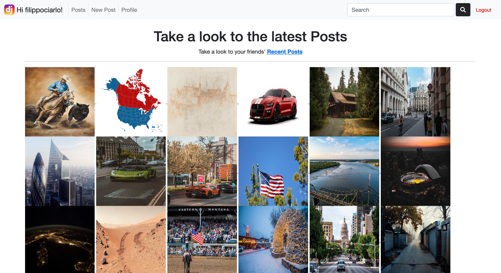

 
Instagram inspired website, share your moment with a picture, describe them with a short descriptiona and a serie of tags. Follow the people that you are interested in and leave a comment or a like under their pictures.
 

---
### Setup
#### 1st Way
Run the BASH script present in the project folder: 
<code>bash ./project_setup_launcher.sh</code>

#### 2nd Way
1. Create a virtual environment 
	<code>python3 -m venv venv</code>

2. Activate the  virtual environment 
	<code>source venv/bin/activate</code>

3. Upgrade the Python package-management system 
	<code>python3 -m pip install --upgrade pip</code>

4. Install the dependencies 
	<code>pip install -r requirements.txt</code>

#### Turn ON/OFF the Virtual Environment:
* To activate the  virtual environment run the following command: <code>source venv_test/bin/activate</code>
* To deactivate the  virtual environment run the following command: <code>deactivate</code>
---

### Run the Website
#### 1st Way
Run the BASH script present in the project folder: 
<code>bash ./project_launcher.sh</code>

#### 2nd Way
1. Apply the unapplied migrations 
<code>python3 manage.py migrate</code>

2. Run the local development server 
<code>python3 manage.py runserver</code>
---

### Run the Tests
#### 1st Way
Run the BASH script present in the project folder: 
<code>bash ./project_tests_launcher.sh</code>

The script will execute the following commands:
> Test all Project 
<code>coverage run --omit='*/venv/*' --omit='*/tests/*'  manage.py test</code> 

> Print in the shell a report about the tested-code coverage 
<code>coverage report</code>

> Make an HTML report about the tested-code coverage in the <code>./htmlcov</code> folder 
<code>coverage html</code>

> Clean all media files produced during the tests execution 
<code>python3 ./cleaning_procedure.py</code>

#### 2nd Way
Test all Project: 
<code>python3 manage.py test</code>

- Test <code>accounts</code> application 
<code>python3 manage.py test accounts</code>

- Test <code>posts</code> application 
<code>python3 manage.py test posts</code>

> After running the tests run the source file of the cleaning procedure, present in the project folder, to clean up all media files produced during the tests execution. 
<code>python3 ./cleaning_procedure.py</code> 

---

### Dependencies
The code use the following dependencies:
* <code>django-environ</code>: Manages Environment Variables
* <code>pillow</code>: Manages Image 
* <code>django-taggit</code>: Handles tagging functionalities 
* <code>django-crispy-forms</code>: Makes forms look better
* <code>crispy-bootstrap5</code>: Provides Bootstrap template pack for <code>django-crispy-forms</code>
* <code>coverage</code>: Helps tracking the executed code during tests

---

### Test Database
Below are the credentials of registered users, which have been used to simulate interactions between registered users on the website. The website administrator credentials are in <strong>bold</strong>.

|Username|Password|
|--------|---------|
|<code>filippociarlo</code>|<code>testpass123</code>|
|<code>JohnDoe</code>|<code>testpass456</code>|
|<code>JaneDoe</code>|<code>testpass789</code>|
|<code><strong>admin</strong></code>|<code><strong>testpass101</strong></code>|

---

<strong>Note:</strong> 
The project it's been tested using Firefox.

